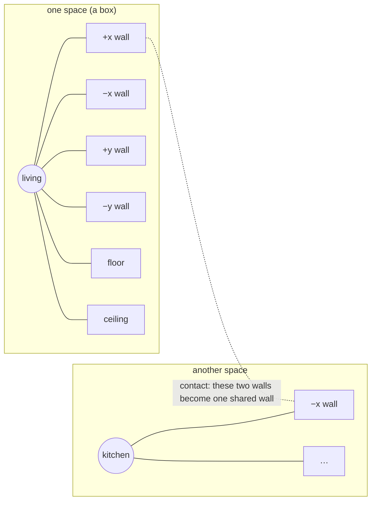
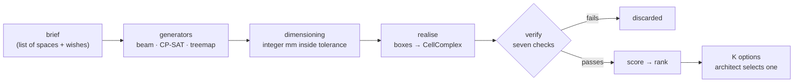

# spacetope — plan

Written 2026-09-13, replanned 2026-09-20. Status: M0–M5, M7 and M8 gates green; M6 (learned scorers) failed its gate four times and is parked. **Current work: the stretch programme M9–M17 (§4.9)**, built in order on branch `m9-stretch`; each milestone's status is kept in the table at the top of §4.9. Plain-language guide: §0. Interactive explainers: Spacetope Field Guide (https://claude.ai/artifact/LogkrcvLKvqZ1Fnq3Zgms7) and Stretch Goals Explorer (https://claude.ai/artifact/1RhyCyuLTcjUGxSydstrCR).

## 0. In plain words (for readers who are not solver engineers)

**The problem.** An architect writes a list of rooms: a name, a width, a length, a height, and how much each
may stretch or shrink (usually ten percent). They add a few wishes: these two rooms must touch, that one
must have a window, every room must be reachable from a corridor. spacetope turns that list into several
complete arrangements of the building, each one already checked, and lets the architect choose.

**The trick.** Instead of drawing rooms as free shapes, every room is a box with six walls, and the
building is described by *which walls touch which*. A wall that touches another room's wall becomes one
shared wall. Stack a room's ceiling on another room's floor and you have a floor level. That is the whole
vocabulary: boxes, walls, and pairs of walls that touch.



**Why boxes and shared walls.** Because they can be checked exactly. A gap of half a millimetre between two
boxes means they are not touching; an overlap of five centimetres means a sliver of a room exists that
nobody asked for. So every position is an integer number of millimetres, and the geometry kernel
(topologicpy) is asked to build the building from the boxes and then report back which walls it found
shared. If what it found matches what we intended, the option is real. If not, it is thrown away. Nothing
is nudged to make it fit.

**What "an option" is.** One arrangement that passed every check, with scores: how many wished-for
contacts it delivers, how far room sizes drifted from the request, how compact it is, how much of the
floor is corridor, how well walls line up between floors, whether every room has an outside wall. The
architect sees several and picks; the program never picks for them.

**How the arrangements are found.** Three engines exist today and two more are designed. They differ in
what they search over and what they can promise (§2.1). In one sentence each:

- *Beam search* places rooms one at a time against walls that already exist, keeping the best few partial
  buildings at every step. Fast, gives many options, weak when the corridor runs out of wall.
- *CP-SAT* hands the whole problem to a constraint solver: every room's position and size are unknowns, every
  wish is a rule, and the solver finds arrangements that obey all rules at once. Exact, slower, proves
  impossibility when a brief cannot be built.
- *Treemap* slices a rectangle into pieces proportional to room areas. Instant, ignores wishes, exists as a
  baseline and a seed.
- *Rectangular dual* (designed) starts from the wish graph and enumerates every distinct way the rooms can
  tile a rectangle so that all wished contacts are walls.
- *Sequence pair with annealing* (designed) encodes an arrangement as two orderings of the rooms and
  improves it by swapping, for buildings too large for the solver.



**What the checks are.** The complex builds at all; it has exactly one cell per space; no sliver cells; every
intended shared wall exists; every cell kept its name tag; the wishes that are rules (levels, envelope)
hold; every planned door fits its wall and every room can walk to a stair or corridor through doors.

**Where it stands (2026-09-19).** Briefs up to about 15 spaces per level are solved by both engines in
seconds. At about 20 rooms on one corridor the beam stops producing valid options and the solver needs
minutes: the corridor's wall runs out, which is also what happens in real buildings, and the answer there is
a second corridor. Learning-based proposal (M6) was tried and did not beat the hand-tuned engine.

## 1. What we are building

Input: an architect's **brief** — a list of spaces with nominal width/length/height, a tolerance band, a program tag, and optional wishes (must-touch pairs, must-be-exterior, access needs). Output: **K verified, scored cell complexes** (topologicpy `CellComplex`) in which every space is a `Cell`, shared faces are real non-manifold faces, corridors provide horizontal movement and stairs/elevators provide vertical movement. The architect selects one option and carries it to the next stage. Later: a global volumetric envelope and a fixed number of levels; eventually an algorithm or model that proposes assemblies directly from the brief.

## 2. The core mechanism: wall-node graphs and contact edges

Every space `s` becomes a **SpaceGraph**: a star with a `space` node and six **wall nodes** `s.+x, s.-x, s.+y, s.-y, s.floor, s.ceiling`. Each wall node carries (as a topologicpy `Dictionary` when realised, as node attributes in networkx while searching):

- `normal` (unit axis), `extent` (width × height of that face, in the tolerance band),
- `used` segments (which parts of the face already touch something),
- rules: `may_touch` (programs allowed to abut), `must_exterior` (daylight), `needs_door` (access),
- the realised `face_id` once built.

The **assembly graph** is the union of all SpaceGraphs plus **contact edges** between wall nodes of different spaces. A contact edge `a.+x — b.-x` means "these faces will be coincident over a rectangle of area ≥ min". Rules:

- Normals must be opposite; a wall may carry several contact edges (a long wall abuts several rooms — topologicpy splits the face automatically, verified).
- `ceiling — floor` contacts are the **vertical** mechanism: a stair cell on one level shares its ceiling with the stair cell above. Levels are therefore emergent (distinct z-bands), not modelled explicitly at first.
- Circulation is not special-cased in the graph: a corridor is a space with a fixed width band and a free length; a stair/elevator is a space with a fixed footprint that must be stacked. Access = every habitable space has ≥ 1 contact edge with a circulation space whose overlap fits a door.

The assembly graph is **intent**. Realisation solves exact coordinates (integer mm) for it, builds boxes, calls `CellComplex.ByCells`, and reads back the **realised graph** with `Graph.ByTopology(cc, direct=True, viaSharedTopologies=True)`, whose shared-face vertices are exactly our wall nodes. Verification = intended contact edges ⊆ realised shared faces. This makes the wall-node idea both the search representation and the ground truth.

Why this works with the literature: the set of contact edges is a **relational encoding** (Flemming's orthogonal structures, VLSI sequence pairs, Wu et al.'s left/right/above/below Booleans). Given the relations, sizes within tolerance are a small LP; given sizes, the relations are a combinatorial search. We keep both halves separable (`docs/ALGORITHM_SURVEY.md` §Ranked shortlist).

### 2.1 The generator options, rigorously

All generators share one contract: `(brief, params, seed) -> list[placement]`, where a placement is an
integer-millimetre box per space. What differs is the search space, the guarantee, and the failure mode.

| Generator | Searches over | Guarantees by construction | Cannot promise | Cost (measured, seed 0) | Use when |
|---|---|---|---|---|---|
| `beam` (`solve/beam.py`) | sequences of wall-to-wall attachments; state = partial placement; width-K frontier | no overlaps; every attachment is a real shared wall with door-width overlap where a door is needed; K distinct signatures if they exist | that every required contact is met (it is scored, not enforced); that a valid placement is found when corridor frontage is nearly exhausted | 0.2–1.4 s for 7–15 spaces; 40 s and 0 valid at 50–64 spaces | every brief first; multi-level with shafts; warm start for CP-SAT |
| `cpsat` (`solve/cpsat.py`) | all placements at once: integer sizes in bands, positions, rotation, one Boolean per (pair, side) | every required contact is a shared wall with door overlap; no overlaps (`AddNoOverlap2D`); shafts share footprints; access by door for every room; INFEASIBLE reported when no arrangement exists | a solution inside a small time budget on coupled levels (89 s for the 11-space clinic, 245 s for the 64-space school) | 0.7–90 s at ≤ 15 spaces; 4–5 min at 50–64 | rich room-to-room wishes; proving a brief impossible; the reference answer for the beam's quality |
| `treemap` (`solve/treemap.py`) | a slicing tree over a rectangle with areas proportional to w·l | a valid tiling with no dead space | any wish, any dimension band, more than one level | milliseconds | baseline in the bench; seed for search |
| `dual` (designed, §M9) | all regular edge labellings of the triangulated wish graph | every wished contact is a wall; every room with an exterior wish is on the outside; enumeration is complete for one triangulation | briefs whose wish graph is not planar; tiny dead space unless `void` cells are allowed | milliseconds per labelling (estimate) | wish graphs with many room-to-room doors (house, gallery, clinic) |
| `seqpair` (designed, §M9) | two orderings of the rooms per level, improved by simulated annealing | a complete relation per pair; exact contacts after re-dimensioning | optimality; completeness | seconds for 60 rooms (estimate) | levels with 20–60 coupled rooms where CP-SAT exceeds a minute |

Two properties hold for every generator and are what make the options comparable:

- **The same verifier.** No generator's output is trusted. Every placement goes through the same
  realisation and seven checks; a generator that "guarantees" something only shortens the search.
- **The same signature.** Two options are distinct when their sets of shared walls differ, not when
  coordinates differ. Generators are compared on distinct verified options per unit time, which is the
  column that matters to an architect choosing among alternatives.

```mermaid
flowchart TB
  subgraph beam["beam: build up"]
    b0["corridor"] --> b1["+ office_a on +x"] --> b2["+ office_b on +x"] --> b3["… one room per step, keep best K states"]
  end
  subgraph cpsat["CP-SAT: all at once"]
    c0["x, y, w, l per room in bands<br/>touch[a,b,side] Booleans"] --> c1["no-overlap + required touches + access"] --> c2["minimise deviation + perimeter"] --> c3["solution → block it → next"]
  end
  subgraph dual["dual (designed): from the graph"]
    d0["wish graph"] --> d1["triangulate, 4 corners"] --> d2["edge labelling = one plan topology"] --> d3["walls as segments → integer sizes"]
  end
```



## 3. Pipeline

```
brief.yaml ──► Brief (Space list, wishes)
      │
      ▼
SpaceGraphs (networkx) ──► compat.py: candidate contact edges (opposite normals, extents, programs, doors)
      │
      ▼
Generators (each: (brief, params, seed) -> assemblies)
   M2  beam search over wall-to-wall attachment (+ treemap seed, + corridor spine)
   M4  CP-SAT relational model (exact, K solutions)  |  optional rectangular-dual enumerator
      │
      ▼
Dimensioning: LP / CP-SAT on integer mm grid inside tolerance bands  ──► coordinates
      │
      ▼
realise.py: Cell.Box per space + selector dictionaries ──► CellComplex.ByCells ──► TransferDictionariesBySelectors
      │
      ▼
verify.py: not None, cell count, no slivers, intended ⊆ realised contacts, dictionaries present
      │
      ▼
score.py: metrics (survey §H) ──► Pareto / weighted ranking ──► K Options
      │
      ▼
io/: BREP + selector sidecar, GLB-per-cell, graph JSON  ──► viz (Plotly now, web canvas in M5)
```

## 4. Milestones, gates and iteration loops

### 4.0 Gate infrastructure (built in M0, used by every milestone)

**Gates are pytest modules.** `tests/gates/test_m{N}.py` holds one test per gate line below; `pytest -m gate_m2` *is* the M2 gate. A milestone is done when its gate module is green in CI and every earlier gate module is still green. Gate tests read the fixtures in `fixtures/` and never depend on the network.

**The scoreboard.** `bench.py` runs every registered generator on every fixture with a fixed seed set (`seeds = 0..4`) and writes `bench/scoreboard.csv` with one row per (generator, fixture, seed):

| column | definition |
|---|---|
| `options` | candidates returned |
| `verified` | candidates passing all six `verify` checks |
| `distinct` | verified candidates with unique **relation signature** (below) |
| `adjacency` | mean required-contact satisfaction over verified options |
| `deviation` | mean Σ|d − d*|/d* over verified options |
| `compactness` | mean external surface ÷ volume |
| `circulation` | mean circulation area ÷ net area |
| `stacking` | mean structural-alignment score (0 before M3) |
| `t_gen`, `t_realise` | wall seconds for generation, and for topologicpy build + verify |

`bench/history/<date>_<milestone>.csv` is committed at each gate so the numbers can be compared across milestones. Gates from M2 on are written as thresholds on scoreboard columns, so the same command answers "did we pass" and "did we regress".

**Relation signature** (`spacegraph.signature(assembly)`): the sorted tuple of `(space_a, side_a, space_b, side_b)` contact edges with spaces named canonically. Two options are *distinct* iff signatures differ. Tested in M0; used by every "distinct" threshold.

**Iteration rule.** Each gate lists what to measure when it fails and the maximum number of fix-and-rerun rounds. When the rounds are exhausted the milestone stops, the failing number is written into `docs/PLAN.md §5 Decisions` with the options considered, and the scope is re-decided with the architect rather than by loosening the threshold silently.

### M0 — Foundations (≈ 2 days)

Build: `pyproject.toml`; `.venv` on Python 3.11.9 with `topologicpy==0.9.57 topologic_core==8.0.0 networkx ortools shapely scipy pytest pyyaml plotly trimesh`; `spacetope/brief.py` (`Space`, `Brief`, YAML/JSON loader, integer-mm conversion, `band(nominal) -> (lo, hi)`); `spacetope/spacegraph.py` (`SpaceGraph`, `AssemblyGraph`, contact-edge validation, `signature`); fixtures `three_rooms.yaml`, `eight_rooms_corridor.yaml`, `two_levels_stair.yaml`; `bench.py` skeleton writing an empty scoreboard.

Gate `tests/gates/test_m0.py` (+ `tests/test_topologic_smoke.py`):
- `test_pins`: imported topologicpy version == 0.9.57 and topologic_core == 8.0.0.
- `test_smoke_*` (ported from `docs/experiments/exp.py`): exact touch → 2 cells, 1 shared face; gap 5e-5 → 2 cells; gap 5e-4 → `None`; overlap 0.05 → 3 cells (documented sliver); 3×2 box on 8×4 wall → shared face area 6.0; stacked → 1 shared horizontal face; disjoint → Cluster with 2 cells, graph 2v/0e.
- `test_selectors`: dictionaries on all cells after `TransferDictionariesBySelectors(..., numWorkers=1)`; BREP round-trip preserves cell count.
- `test_brief_roundtrip`: each fixture loads, every dimension converts to an integer mm and back within 1e-6 m; `band` returns integers with lo < nominal < hi.
- `test_assembly_validation`: hand-written three-room assembly graph is valid; the same graph with one same-normal contact edge raises; with a contact to a nonexistent wall raises.
- `test_signature`: two assemblies differing only in space order have equal signatures; swapping one contact changes it.

Iterate on failure: a smoke test failing means the library behaves differently from `docs/TOPOLOGICPY_NOTES.md`; re-run the experiment script, update the notes with the new `[RUN]` fact, then adjust the rule, never the assertion alone. Max 2 rounds.

### M1 — Realiser, verifier, scorer, quick viewer (≈ 3 days)

Build: `realise.py`, `verify.py` (six checks, returns a `VerifyReport` listing each failed intended contact with cause `gap | overlap | missing`), `score.py` v0 (adjacency, deviation, compactness, circulation), `viz/plotly.py`, `io/brep.py` (BREP + selector sidecar), `io/graph.py`, CLI `spacetope realise <fixture> <assembly.json> --html out.html`, and hand-placed coordinate files `fixtures/placed/*.json` for the three-room and eight-room fixtures.

Gate `tests/gates/test_m1.py`:
- `test_realise_three_rooms`: `len(Cells) == 3`, `NonManifoldFaces` count == intended contacts, every cell dictionary has `name, program, w, l, h`.
- `test_realise_eight_rooms_corridor`: 9 cells, all intended contacts realised, `t_realise < 2 s`.
- `test_verify_catches_gap`: a placed file with one box shifted +0.5 mm → report lists exactly that contact with cause `gap`, option not verified.
- `test_verify_catches_overlap`: a box shifted −50 mm → cause `overlap`, cell count mismatch reported.
- `test_verify_catches_missing`: an intended contact removed from the placement → cause `missing`.
- `test_scores_bounded`: all four metrics in [0, 1] or documented range; adjacency == 1.0 on the correct placement.
- `test_persistence_roundtrip`: save BREP + sidecar, reload, dictionaries present on every cell, `signature` of the realised graph unchanged.
- `test_html_written`: Plotly file exists and is < 200 KB with CDN plotly.

Iterate on failure: if a realised contact is missing, dump both faces' plane equations and mm coordinates; the fix is in `realise` rounding or in the placed file, never in tolerance. Max 3 rounds.

### M2 — Generator v1: beam search, single level (≈ 1–2 weeks)

Build: `solve/grid.py` (integer interval tests), `solve/beam.py` (state, moves, heuristic, beam width `B`, `K` outputs, seed, dedupe by signature), corridor spine, treemap baseline (`solve/treemap.py` with `squarify`), post-pass LP re-dimensioning, `bench.py` registration of `treemap` and `beam`.

Gate `tests/gates/test_m2.py` — thresholds on `bench/scoreboard.csv` for fixture `eight_rooms_corridor`, seeds 0–4:
- `beam`: `distinct ≥ 5` on every seed; `verified == options` (nothing unverified is returned); `adjacency ≥ 0.9` mean; `deviation ≤ 0.10` mean; `t_gen + t_realise < 10 s` per seed.
- `treemap`: `verified ≥ 1` on every seed (baseline exists and is exact).
- `three_rooms`: `beam` finds the hand-placed M1 signature among its options on at least 4 of 5 seeds (recall check).
- Determinism: two runs with the same seed give identical scoreboard rows.
- Unit: `grid.overlap_len`, `grid.touches` on 20 hand cases; a move that would overlap is rejected in O(n).

Iterate on failure, in this order, max 4 rounds: (1) `verified < options` → bug in realise/verify contract, fix first; (2) `distinct < 5` → inspect signature collisions, widen `B`, add a diversity penalty in the beam; (3) `adjacency < 0.9` → raise adjacency weight, check corridor spine reaches all rooms; (4) time → profile, move validity checks to numpy, cap `B`. Record each round's row in `bench/history/`.

### M3 — Vertical movement, emergent levels, first constraints (≈ 1–2 weeks)

Build: stacked stair/elevator spaces with `ceiling — floor` contacts, cores-first assembly, brief fields `envelope` (AABB) and `levels`, metrics `stacking`, `vertical_connectivity`, `envelope_fit`, `daylight`; `verify` gains checks for envelope containment and level count.

Gate `tests/gates/test_m3.py` on fixture `two_levels_stair` (8 rooms, 2 corridors, 1 stair, 1 elevator):
- `beam`: `distinct ≥ 3` on every seed; `verified == options`; every option's realised graph is connected and every path between levels passes through a `stair` or `elevator` cell (networkx cut test); stair and elevator cells share a horizontal face with their counterpart above; `t_gen + t_realise < 30 s`.
- Level count: distinct z-bands == `levels` in the brief for every option.
- Envelope: an option is rejected by `verify` when any cell leaves the AABB (negative test with a shrunken envelope); with the fixture envelope `verified == options`.
- `stacking ≥ 0.5` mean (half of internal wall planes align across levels).
- M2 gate still green (regression).

Iterate on failure, max 4 rounds: connectivity failures → cores-first ordering bug, check that corridors on each level contact the core; stacking low → add alignment term to the move heuristic; time → run levels in parallel with plain specs per process.

### M4 — Exact engine: CP-SAT relational model (≈ 2 weeks)

Build: `solve/cpsat.py` (integer vars in bands, `AddNoOverlap2D` per level, Boolean `touch[a,b,side]` ⇒ coordinate equality + overlap ≥ door, required contacts hard, wishes in objective, K solutions via callback + blocking clauses on signature); registration as generator `cpsat`; synthetic 30-room brief `fixtures/office_30.yaml` with two zones; optional `solve/dual.py`.

Gate `tests/gates/test_m4.py`:
- `cpsat` on `eight_rooms_corridor`: `distinct ≥ 5`, `verified == options`, `adjacency == 1.0` (required contacts are hard), `deviation ≤ beam deviation` on the same seed, `t_gen < 60 s`.
- `cpsat` on `two_levels_stair`: same, `t_gen < 60 s`, all M3 structural assertions hold.
- `cpsat` on `office_30`: `distinct ≥ 3`, `verified == options`, `t_gen < 300 s` with hierarchical zoning.
- Infeasibility is reported, not hidden: a brief with contradictory required contacts returns status `INFEASIBLE` and zero options, and `verify` is not called.
- Optional `dual`: on `eight_rooms_corridor` every enumerated dual dimensioned by LP passes `verify`.
- M2 and M3 gates still green.

Iterate on failure, max 4 rounds: time → symmetry breaking (lexicographic order on identical rooms), tighten bands, zone decomposition; `distinct` low → blocking clause too weak (block on signature, not coordinates); deviation worse than beam → objective weights.

### M5 — Web canvas and option selection (≈ 2–3 weeks)

Build: FastAPI `POST /brief`, `POST /generate` (thread-offloaded, job id), `GET /options/{id}`, `POST /select`; session topology store; frontend: three-layer canvas, assembly-graph layer, options gallery, brief editor, select-and-proceed export; Playwright suite in `e2e/` (mocked backend for CI, real-backend run on demand).

Gate `tests/gates/test_m5.py` + `e2e/`:
- API: `POST /generate` on `two_levels_stair` returns a job that completes; `GET /options` returns `K ≥ 3` items each with `scores`, `graph`, `glb_url`; the GLB has exactly `len(Cells)` nodes named `cell_{i}`; `POST /select` writes BREP + sidecar + graph JSON.
- Round trip: the exported selection re-imports in Python with dictionaries on every cell and an unchanged signature.
- E2E (Playwright, mocked): loading the fixture shows the brief table; "Generate" shows ≥ 3 option cards; clicking a card puts a `cell_*` mesh in the r3f scene and the assembly graph on the xyflow layer; clicking a contact edge highlights one face; "Select" triggers the export call.
- Performance: first option visible < 15 s on the two-level fixture with the beam generator.
- No leftover imports from the earlier canvas remain (grep gate for `supabase`, `credits`, `fnf`, `strand`).

Iterate on failure, max 3 rounds: GLB node count wrong → ordering between `Topology.Cells()` and the scene builder; e2e flaky → mock the generator, never sleep-wait.

### M6 — Learning the proposal (research track, after M4)

Build: dataset export (brief graph + signature + scores per verified option, plus adjacency graphs from real IFC buildings), Model A GNN move-scorer inside beam search, Model B graph-conditioned relation-set generator with CP-SAT dimensioning, RL post-training with §H metrics as rewards.

Gate `tests/gates/test_m6.py` on a held-out set of 20 synthetic briefs (8–30 rooms, 1–3 levels) not used in training:
- `beam+gnn` vs `beam` at equal wall-time budget: `distinct` ≥, `adjacency` ≥, `deviation` ≤ on the mean over the held-out set, and no held-out brief where `verified == 0`.
- Model B: ≥ 50 % of proposed relation sets dimension to a verified option without repair.
- Dataset integrity: every row's signature re-realises and re-verifies from stored coordinates.

Iterate: this milestone is allowed to fail its gate; the outcome is recorded in `docs/PLAN.md §5` either way. Max 3 training rounds before re-scoping.


### M7 — Vertical circulation and doors (planned 2026-09-13)

Stairs and lifts become single spaces spanning the levels they serve; corridors are generated per level from a template; doors are placed where access is needed (corridor to every stair and lift on each served level, one door per room to a corridor); briefs are expanded and validated before generation. Floor-count search follows as M8.

### 4.9 Stretch programme M9–M17 (replanned 2026-09-20)

Sources: `docs/2026-09-14_STRETCH_GOALS_DESIGN.md` (pieces A–E, prototype results in B.9),
`docs/2026-09-14_PERFORMANCE_GRAPH_LEARNING_EXPLORATION.md` (performance levers, graph-driven
generation, brief programmes, learning phases), `docs/2026-09-20_TOPOLOGICPY_OPPORTUNITIES.md`
(topologicpy options 1–4). The order follows what was measured, cheapest and surest first. Every
milestone keeps all earlier gates green; the iteration rule of §4.0 applies (max rounds, then a
decision row, never a silently loosened threshold).

| # | Milestone | Why now | Status |
|---|---|---|---|
| M9 | topologicpy, pinned: TGraph adapter, topology-distinct count, dataset export | nearly free; 5× on graph builds; honest "distinct" | **done 2026-09-20**, gate 9 green |
| M10 | Measured engine fixes: CP-SAT time split, frontage cut, pure pre-verify, build only what is shown | the large briefs fail on budget and on building everything | **done 2026-09-20**, gate 10 green |
| M11 | A — cross-level alignment as a soft term in CP-SAT | closes the one gap in the cores-first discipline | **done 2026-09-20**, gate 4 green |
| M12 | B — rectangular-dual generator `dual` (single level) | prototype gave 8 verified topologies where the beam gives 3 | **done 2026-09-20**, gate 8 green; one gate line corrected, see §5 |
| M13 | C — Z3 cross-check in `bench/` | guards M10–M12's solver models | **done 2026-09-20**, gate 4 green |
| M14 | topologicpy 0.9.71: pin bump, TPY persistence, egress redundancy | licence fix; one-file options; a new hard check | **done 2026-09-20**, gate 5 green, every earlier gate green on the new pin |
| M15a | E — the beam on tight corridors: tight-corridor mode, chains of room partners placed as one run | the beam's two measured failure modes | **done 2026-09-20**, gate 4 green |
| M15b | E — chained (L, U) corridors | briefs that need more frontage than one straight corridor has | **done 2026-09-20** with `cpsat`, gate 5 green; the beam reaches it on one seed in four, recorded |
| M15c | E — the gap-closing pass | dead space between rooms along a corridor | **closed 2026-09-20: not needed**, measured; gate 8 keeps it so |
| M16 | D — sequence pair + annealing `seqpair` | 20–60 coupled rooms per level | **gate failed 2026-09-21** (allowed, §4.0): encoding and packer delivered and tested, generator not registered, see §5 |
| M17 | Brief programmes and the L0 dataset | benchmarks per building type; data for learning | planned |
| L1–L3 | Learning on graphs (research track) | only after M12 or M16 provides a decoder | parked |

#### M9 — topologicpy on the pinned version (≈ 2 days)

Build: `spacetope/tgraph.py`, the only module that imports `topologicpy.TGraph` (adapter rule: the
search layer stays free of topologicpy); realised wall-node graph and door graph through
`TGraph.ByTopology` with the `Graph` path kept as fallback; `pipeline.topology_classes(options)`
(exact labelled isomorphism with networkx; label = program + nominal size) and a `distinct_topologies`
column in `run_generator` and `bench.py`; `score.analysis(realised)` returning betweenness, cut vertices
and bridges of the door graph (reported, not ranked, so METRICS and the UI weights stay stable);
`learn/dataset.export_pyg(options, path)` through `TGraph.ExportToCSV`.

Gate `tests/gates/test_m9.py`:
- On `three_rooms`, `eight_rooms_corridor`, `two_levels_stair`: the TGraph wall-node graph has the same
  order, size and named vertices as the `Graph` one, and the TGraph door graph yields the same door
  pairs as `doors.door_graph`.
- TGraph build time ≤ Graph build time on `two_levels_stair` (measured 0.037 s vs 0.190 s).
- `distinct_topologies ≤ distinct` always; on `eight_rooms_corridor` beam seed 0 it is < `distinct`
  (the identical-office swaps collapse).
- `export_pyg` writes `nodes.csv`, `edges.csv`, `graphs.csv`; row counts match the options.
- M1, M5 and M7 door gates still green.

Iterate (max 2): a mismatch between TGraph and Graph graphs is a library fact → record in
`docs/TOPOLOGICPY_NOTES.md`, keep `Graph` for that call.

#### M10 — Measured engine fixes (≈ 1 week)

Build: (1) CP-SAT budget: the first solve gets the whole remaining budget, later solves
`remaining / (k − i)`; (2) redundant frontage constraint per corridor side (Σ widths of rooms touching
that side ≤ corridor length); (3) `verify.preverify(brief, placement)`: the five checks that need no
kernel (overlaps, required contacts, constraints, door planning, access) on integer boxes; (4)
`pipeline.generate(..., build="top", keep=K)`: pre-verify all, rank on box-computable scores, realise
only the K shown; `build="all"` stays the default for gates written before M10.

Gate `tests/gates/test_m10.py`:
- `preverify` never accepts what `verify` rejects on every option of every fixture generator pair used
  in earlier gates (no false accepts); it may reject less.
- `small_hospital` with `cpsat`, 300 s: ≥ 1 verified option (was 0 through the generator).
- `eight_rooms_corridor` beam k=8 with `build="top", keep=3`: same top-3 signatures as `build="all"`,
  `t_realise` ≤ half.
- `clinic` with `cpsat`: `t_gen` ≤ 60 s (was 89 s) with the frontage cut, same adjacency.

Iterate (max 3): hospital still empty → per-level decomposition with shafts fixed from the beam hint
(exploration note §2.3) before anything else.

#### M11 — A: soft stacking in CP-SAT (≈ 2 days)

Build: design note §A. Reified plane equalities between rooms on adjacent levels whose bands allow it,
weighted `w_stack` in the objective, hinted from the beam warm start.
Gate (extends `test_m4.py` in `test_m11.py`): on `two_levels_stair`, `three_levels_core`,
`apartments_four_levels` the best CP-SAT `stacking` ≥ beam best − 0.05 on the same seed; `t_gen` within
+20 % of the pre-M11 time; adjacency 1.0.

#### M12 — B: rectangular-dual generator (≈ 2 weeks)

Build: `spacetope/solve/dual.py` from `docs/experiments/2026-09-20_dual_proto.py`, with the three rules
of design note B.9 (through corridors on the outer walk, void ring with flank rooms on the wall,
staircase choice per void pair); generator `dual` registered with `multi_level: False`;
`GeneratorUnsupported` for non-planar wish graphs; options deduplicated by topology class (M9), not by
signature.
Gate `tests/gates/test_m12.py`:
- `eight_rooms_corridor`, `three_rooms`: `verified == options`, one option per topology class, adjacency 1.0,
  `t_gen < 60 s`; `eight_rooms_corridor`: `distinct_topologies ≥ 5`. (Corrected 2026-09-20: "≥ 5 on `three_rooms`" was
  ill-posed, see §5; a test pins that the dual reaches no more classes than the beam there.)
- `clinic`: ≥ 1 verified option.
- A K5 wish graph raises `GeneratorUnsupported`; nothing is returned.
- `dual` beats `beam` on `distinct_topologies` on `eight_rooms_corridor` (the reason it exists).
Known open (not gated): `house_ground`, `gallery_rich` (room-to-room doors); tracked in §6.

Iterate (max 4): low sizing rate → enumerate staircase directions instead of sampling them; then voids
between chained rooms.

#### M13 — C: Z3 cross-check (≈ 2 days)

Build: `bench/z3check.py`, `z3-solver` as a dev dependency. Gate `test_m13.py` (slow): distinct
required-touch assignments on `three_rooms` and a 4-room brief agree between Z3, CP-SAT with large `k`,
and bound the dual's count; the contradictory brief of the M4 gate is UNSAT.

#### M14 — topologicpy 0.9.71 (≈ 1 week)

Build: pin bump as a verify-everything task (all gates, every `[RUN]` fact in the notes rechecked);
`io/tpy.py` save/load through `Topology.ExportToTPY/ByTPYPath` beside the BREP path;
`score.egress` from `TGraph.DisjointPaths`/`MinimumCut` on the door graph; licence note updated.
Gate `test_m14.py`: TPY round trip keeps every cell dictionary and every door on all multi-level
fixtures; a brief with two stairs scores egress 2, with one stair 1; every earlier gate green on the
new pin.

#### M15 — E: corridors (≈ 2 weeks; M15a and M15b done, M15c measured and dropped)

Build: beam corner move for rooms needing a corridor and a room partner; frontage budget prune;
`circulation.corridor.segments: 2` expansion into chained boxes; gap-closing pass.
Gate `test_m15.py`: `school_three_levels` and `small_hospital` beam `verified ≥ 4/8`; `test_m15b.py`: a
two-segment corridor fixture realises with every room accessed. The third gate line, "M2 dead-space metric falls
on `hotel_floor`", was **withdrawn on 2026-09-20**: it assumed gaps that do not exist (§5), and `test_m15c.py`
asserts the property it was reaching for instead.

#### M16 — D: sequence pair + annealing (≈ 3 weeks)

Build: design note §D on the M12 sizer or on compaction; generator `seqpair`.
Gate `test_m16.py`: on a 60-room synthetic level `verified ≥ beam`, `t_gen < 60 s`; warm-started from
the beam on `eight_rooms_corridor` deviation ≤ beam. **Both lines failed on 2026-09-21** (§5). The module
`spacetope/solve/seqpair.py` and its gate stay as a tested research result: the gate now pins what the encoding
does, what the annealer does not, and why the generator is not registered.

#### M17 — Brief programmes and L0 (≈ 1 week)

Build: `spacetope/programme.py` (`sample`, `variations`), `programmes/*.yaml` (office from `synth.py`,
school, clinic, housing), CLI `spacetope programme`, dataset rows through M9's export.
Gate `test_m17.py`: 100 sampled briefs per programme validate; frontage warnings match the measured
failure threshold; ≥ 5,000 verified rows per hour with M10's pre-verify.

#### Learning L1–L3 (research, parked)

Entry conditions in the exploration note §5: L1 needs a decoder (M12 or M16) with ≥ 90 % decode
success; L2 needs L1 and a millisecond environment; L3 needs a synthetic-data plateau. Four training
rounds per phase, then a decision.

## 5. Decisions (with why)

| Date | Decision | Why |
|---|---|---|
| 2026-09-13 | Pin topologicpy 0.9.57 / topologic_core 8.0.0 | Installed locally, validated in earlier work with documented gotchas; 0.9.68 is signature-compatible, bump later through the smoke suite. |
| 2026-09-13 | Integer-millimetre grid inside solvers | Kernel tolerance 1e-4 is a coincidence epsilon, not healing; mm integers → metres with 6 decimals are exact. |
| 2026-09-13 | Wall nodes = six per space, including floor and ceiling | Vertical movement becomes the same mechanism as horizontal (`ceiling — floor` contact); levels emerge rather than being modelled. |
| 2026-09-13 | Every cell is a box at first; L-corridors = chained boxes | Sloped/L cells break face sharing rules and the LP; boxes keep the relational encoding clean. Revisit after M4. |
| 2026-09-13 | Beam search first, CP-SAT second | Beam search is native to the wall-node metaphor and gives options in seconds; CP-SAT gives exactness and hard constraints; both share `realise/verify`. |
| 2026-09-13 | Selector-sidecar persistence (BREP + JSON), not topologic JSON | Topologic JSON round-trip drops sub-topology dictionaries (verified 0.9.57 and 0.9.68). |
| 2026-09-13 | Plotly first, web canvas in M5 | Do not pay the frontend cost before the generators produce something worth looking at. |
| 2026-09-13 | Tolerance = per-side ±10 % by default | Simplest to encode as integer bounds; area drift is reported as a metric; can be made area-preserving per space later. |
| 2026-09-13 | Beam heuristic weights `w_dead=0.25`, `w_dev=100` (sweep in M2) | With `w_dead=2` the corridor stretched to 20 m and mean deviation was 0.105; the sweep gave 0.007 with adjacency 1.0. |
| 2026-09-13 | Re-dimensioning objective = fractional deviation (same metric as `score.deviation`) + small perimeter term | An absolute-mm objective raised deviation from 0.072 to 0.105 by stretching rooms to shorten the corridor. |
| 2026-09-13 | Level height = `brief.level_height` or tallest space; every space on a level takes that height (M3) | Keeps floor/ceiling planes coincident across the level so stacked cells share faces; the h deviation is recorded per cell. Open question 6 resolved for now. |
| 2026-09-13 | Cores first: level 0 assembled by the beam, cores copied to every level at the same footprint, upper levels assembled around them with a stacking bonus | Vertical contacts are exact by construction; 8/8 verified options with stacking 0.81–0.87 on the two-level fixture. |
| 2026-09-13 | Walkable access graph excludes room-over-room floor contacts | A shared floor is not a door; vertical connectivity is measured only through stair/lift stacks. |
| 2026-09-13 | `score.deviation` is rotation-invariant | A 4×3 room laid 3×4 is exact; the first CP-SAT runs reported 0.33 deviation purely from rotations. |
| 2026-09-13 | Beam scoring is incremental (aggregates carried in `State`), relation keys are incremental, offsets only align with co-planar neighbours, rooms attach to required partners first and never cap a corridor's ends | office_30 went from 152 s to 2.2 s per seed with adjacency 0.52 → 1.0; the deviation penalty is summed per space (a mean let one 44 m corridor hide behind 29 exact rooms). |
| 2026-09-13 | CP-SAT is warm-started with the best beam placement (`AddHint`) | Survey G6/C11: heuristic → CP-SAT warm start finds feasible instantly and lets the budget go to optimisation; K options come from blocking clauses on the required-touch literals. |
| 2026-09-13 | CP-SAT does not choose levels; it takes `levels.assign_levels` | Layered discipline (survey D5): floor assignment is a small separate decision; the model stays 2D-per-level with stacked core equalities. |
| 2026-09-13 | Viewer GLBs are built from the placement boxes, not by re-triangulating topologic cells | GLB export took 6.5 s of a 14.3 s job on the two-level fixture. `verify` already proves each built cell equals its box, and a gate test checks bounds and volume against the topologic path cell by cell. |
| 2026-09-13 | The wall-node graph payload is computed lazily when an option is opened, then cached | It cost 1.8 s for 8 options up front, but the browser only opens one option at a time. |
| 2026-09-13 | The xyflow canvas re-fits after nodes are measured (`useNodesInitialized`) and allows zoom down to 0.05 | Nodes arrive after mount, and xyflow's default minimum zoom of 0.5 cannot fit a two-level graph; 23 nodes rendered under the brief panel. The browser test now asserts every node is inside the canvas. |
| 2026-09-13 | M6 Model A is a linear move scorer trained in numpy by pairwise ranking, not a graph neural network | The disk is 99% full (6.9 GB free) and PyTorch installs at about 524 MB. A GNN stays open pending that decision. The gate compares the learned scorer at beam width 8 with the hand-weighted beam at 16 on 20 held-out briefs. |
| 2026-09-13 | M6 Model B (relation-set generator) is not implemented; its gate test is a strict expected failure | Recorded rather than silently skipped, per the gate rules. |
| 2026-09-13 | Model A trained on 40 single-level synthetic briefs with a width-48 teacher: 520 step groups, 29,997 pairs, loss 0.693 → 0.510, pairwise accuracy 0.717, 92 s | Learned weights favour less dead space (−1.07), shorter perimeter (−0.57), low deviation (−0.50) and using corridor length (−0.24). Three weights are zero, each checked against the saved feature statistics. Stacking and blocked-partners were constant at zero in training (std 1e-9): stacking is undefined on one level, and blocked-partners never fired, a feature-design gap. Progress varies across steps (std 0.23) but is identical within a step's pool, so pairwise ranking cannot learn it. Consequence: the student ignores stacking on multi-level briefs; retraining on multi-level briefs is the fix if the gate shows it matters. |
| 2026-09-13 | M6 gate, linear scorer v1 (single-level training) at width 8 vs hand-weighted beam at 16, 20 held-out briefs: **failed** | Every brief still verified 8 options, but the learned beam was slower (1.55 s vs 1.27 s mean generation) and worse: distinct 7.5 vs 8.0, adjacency 0.966 vs 0.999, deviation 0.0075 vs 0.0049. Results in `bench/history/2026-09-13_m6_heldout.json`; weights kept as `spacetope/learn/weights_v1_single_level.json`. Next: retrain on single- and multi-level briefs and compare with a graph network (PyTorch Geometric, installed with the user's approval). |
| 2026-09-13 | Why the learned beam was slower: the learned scorer ran on every extended candidate before duplicates were merged | On a 30-space brief at width 8 both runs generated the same work (3,337 vs 3,437 moves; 1,194 vs 1,326 full re-evaluations), but the scorer ran 3,437 times at 0.75 ms each, about 2.6 s of the 2.8 s gap. A first profile wrongly put features at 9% because it timed only the 522 post-merge candidates. Fix: learned scores (linear and GNN) are applied after merging, through one code path. |
| 2026-09-13 | Joint retraining on 30 single-level + 20 multi-level briefs (teacher width 32): linear v2 and GNN | Linear v2: 54,409 pairs, pairwise accuracy 0.734; stacking now weighted +0.58 and blocked-partners −0.05 (both were zero in v1). GNN (2 relational GraphConv layers, 48 hidden, linear skip): 1,026 step groups, validation pairwise accuracy 0.921 on 153 held-out step groups, 24 s for 12 epochs on CPU. |
| 2026-09-13 | Re-timing after the fix, two held-out briefs (8 options each, all distinct) | 30 spaces, 1 level: hand w16 3.83 s, hand w8 1.98 s, linear v2 w8 2.67 s, GNN w8 3.47 s; deviation 0.0204 / 0.0203 / 0.0211 / 0.0206; adjacency 1.0 for all. 25 spaces, 3 levels: hand w16 1.87 s, hand w8 1.06 s, linear v2 w8 1.46 s (adjacency 0.929), GNN w8 2.07 s (adjacency 1.0, deviation 0.0013 vs 0). The hand-weighted beam at width 8 already matches width 16 at half the time, so the gate's learned-w8-vs-hand-w16 comparison can credit learning with a gain that comes from the narrower beam. Hand w8 is now reported (not asserted) beside the gate so the learning contribution is visible. |
| 2026-09-13 | Beam scorer and trace hooks (learned scores applied after merging duplicates) are regression-free for the hand-weighted path | M2–M4 gates rerun after the change: 36 passed in 409 s. |
| 2026-09-13 | **M6 gate outcome (three-way, 20 held-out briefs): failed for both learned scorers; allowed to fail** | Means — generation s / distinct / adjacency / deviation. Hand w16: 1.26 / 8.00 / 0.999 / 0.0049. Hand w8 (reported baseline): 0.67 / 8.00 / 0.997 / 0.0073. Linear v2 w8: 0.94 / 7.65 / 0.959 / 0.0078. GNN w8: 1.41 / 7.95 / 0.971 / 0.0070, with one unverified option (7.95 verified). Linear adjacency fell below hand w16 on 12 briefs, GNN on 8, hand w8 on 1. Conclusion: at this data scale (50 teacher briefs) learning adds nothing beyond narrowing the beam, and the GNN costs more than it saves. Results: `bench/history/2026-09-13_m6_heldout_3way.json`. Not pursued further without a decision: more teacher data, a teacher labelled by final verified scores instead of the heuristic, or scoring only the top candidates by hand score. |
| 2026-09-13 | The one unverified GNN option (brief synth_90018, 10 spaces) did not reproduce | A fresh GNN run on that brief verified 8 of 8. The gate log also showed topologicpy "core translate/scale operation failed" messages, which spacetope code never calls directly. Investigated and unresolved: the GNN beam is deterministic (6 repeat runs identical, with 5 threads and with 1), and 40 repeated realise-and-verify runs of that brief's placements in a fresh process gave no failures and no kernel messages. The failure appeared only late in a long gate process that had built hundreds of complexes, so an intermittent kernel failure remains possible. `verify` caught it, so no unverified option was offered. |
| 2026-09-13 | M7 started. Door rules and placeholder sizes (room 0.9 m, stair 1.0 m, lift 1.1 m, 2.1 m high, 0.1 m jambs) confirmed by the user ("continue with the doors as such") | M7 plan D8, D9. |
| 2026-09-13 | M7 open decisions D3, D5, D6 proceed on the plan's recommendations as stated assumptions: legacy per-floor stair briefs are rejected with a message; treemap refuses multi-level briefs; required contacts stay a score | The user asked to continue without choosing; each is reversible. The old `two_levels_stair` fixture stays until the generators handle shafts, so M3–M5 gates stay green meanwhile. |
| 2026-09-13 | M7 decisions D3, D5, D6 confirmed by the user ("ok continue") | Legacy per-floor stair briefs are rejected; treemap refuses multi-level briefs; required contacts stay a score, listed as unmet on option cards. |
| 2026-09-13 | M7.7 migration: `two_levels_stair` is now the compact circulation fixture (8 rooms → 12 spaces after expansion, 12 doors); the API and pipeline validate every brief, not only circulation briefs | The old per-floor version lives on only as an inline example in the legacy-rule test. M3, M4 and M5 gates now assert shafts (z 0, 6 m tall) and door-graph level separation instead of stacked members. |
| 2026-09-13 | Synthetic briefs (`spacetope/synth.py`) use the compact circulation form and return expanded briefs | Held-out set unchanged in seeds (20 briefs, 10–30 spaces, 1–3 levels, 0–2 shafts); the M6 weights were trained on the old form and must be retrained before the M6 gate is rerun. |
| 2026-09-13 | Browser tests run on one Playwright worker; the 15 s first-option limit is unchanged | The first real run missed it (18.0 s) with two test files generating in parallel on one backend. Measured alone, a stair-fixture job takes 7.1–7.3 s (generation 0.34 s). Doors add about 2 s across 8 options: realise 4.90 → 5.32 s, door check 1.54 s, full verify 6.60 s. The circulation test now expects the browser's 422 console message from its deliberate validation failure. |
| 2026-09-13 | Doors are drawn as openings, not slabs (user-reported) | The model was always right: each door is a topologicpy Aperture, a 0.9 × 2.1 m face on the shared wall (12 apertures on 12 of 26 internal walls, no thickness). The GLB export invented a 50 mm box per door, so the viewer showed door leaves. Cell meshes are now built face by face with the door rectangles cut out (exact rectangle arithmetic, no kernel calls), the door node is the aperture face itself, and the viewer draws it double-sided. The gate now asserts each cell's mesh area equals its box surface minus its openings. Building face by face first broke the M5 equivalence check (24 unmerged vertices per box, so trimesh saw no closed shell); the builder now merges shared corners, so a doorless box is watertight and matches the topologic cell's bounds and volume, while a cell with a doorway stays open. |
| 2026-09-13 | M6 re-evaluation after M7 (retrained on compact briefs): gate **failed again**, and every generator got worse on the new synthetic briefs | Retraining: linear v3 pairwise accuracy 0.751 (was 0.734), stacking weight 0.68; GNN validation pairwise accuracy 0.933 (was 0.921); 171 s. Held-out means (verified / adjacency / deviation): hand w16 6.00 / 0.850 / 0.157; hand w8 6.25 / 0.899 / 0.110; linear w8 6.80 / 0.819 / 0.155; GNN w8 1.80 / 0.246 / 0.751. Briefs with no verified option: 3 / 2 / 3 / 15. Before M7 all four were 8/8 at adjacency ~1.0, so shafts, doors and the wider door-overlap rule (door width + 2 jambs, replacing a flat 900 mm) made these briefs materially harder; the GNN collapsed. Results: `bench/history/2026-09-13_m6_heldout_3way_post_m7.json`; pre-M7 copy alongside; weights backed up as `weights_v2_pre_m7.json` / `gnn_v1_pre_m7.pt`. The `blocked` feature is still constant in training (weight 0.0) — a feature-design gap. |
| 2026-09-13 | Root cause of the M7 quality drop: the beam guaranteed the door-width overlap only for the pair it attached, so a pair that needs a door could merely graze | Diagnosis: synth_90014's stair shared 0.5 m of wall with corridors 1 and 2 (a stair door needs 1.2 m) because the corridor attached to the lift and grazed the stair; synth_90002's kitchen_1 shared 1.0 m and needed 1.1 m, so it got no door and could not reach a stair. Fix: `doors.touch_ok` — wherever a door pair touches, the shared wall must fit the door; enforced for every touch in `beam.moves`, with a relaxed last resort if a step would otherwise have no moves, and room-door planning now prefers a door-capable wall over a too-short required contact. Effect on the 20 held-out briefs (hand-tuned beam, seed 0): mean verified options 6.00 → 7.05 of 8, adjacency 0.850 → 0.999, deviation 0.157 → 0.0099, and no brief is left without a verified option (was 3). Gates after the fix: fast 71, M2+M3 11, M7.2–M7.4 19, M4+M5 10; mocked browser tests pass. Remaining gap: three briefs return fewer than 8 distinct options (synth_90012 2/8, synth_90017 6/8, synth_90019 2/8) — the stricter door rule prunes moves, so diversity, not validity, suffers. |
| 2026-09-13 | spacetope is licensed **Apache-2.0** (was GPL-3), with `NOTICE`, `CONTRIBUTING.md` (DCO + CLA) and `CONTRIBUTORS.md`; six viewer files first adapted from an earlier canvas were replaced with clean-room implementations | Goal: publish as a research prototype and still reuse the code in a commercial product. Apache-2.0 keeps that open, the CLA preserves the right to relicense outside contributions, and the rewrite means no borrowed text is published. topologicpy is LGPL-3.0-or-later from 0.9.68 (PyPI), while the pinned 0.9.57 declares AGPL v3 — bumping the pin is now a licence improvement as well. Copyright: the owner states the work was done on personal time with personal resources (own machine and tools), so the copyright is held personally and relicensing stays available. Not legal advice; the CLA wording and the AGPL/LGPL question deserve a lawyer. |
| 2026-09-13 | The six adapted viewer files are gone: clean-room `components/Viewer3D/` (ComplexScene, Viewer3D, ViewerBar, colours) and `stores/viewerStore.js` | Written from the required behaviour, with their own structure and names; importers and the browser test's viewer test id updated; no reference to their origin remains in `frontend/src` or `e2e/tests`. Shared approach remains (a 3D layer that takes the mouse only while orbiting, and `cell_{i}` GLB node naming), which is method, not text. Mocked browser tests pass against the rewrite. |
| 2026-09-13 | M8 started: floor-count search (`spacetope/floors.py`, CLI `spacetope floors`, gate `tests/gates/test_m8.py`) | Three stages as planned: arithmetic bounds, a generation-only sweep per candidate count, then build and verify the best few. A floor-count variant of the brief drops room level wishes and shaft spans, and **remaps** room↔corridor contacts onto a corridor that exists at that count, keeping rooms that must touch each other on one floor — dropping those contacts instead left rooms with no corridor to open onto (three rooms without a door at 2 floors). |
| 2026-09-13 | Plate area alone is an optimistic bound: corridor wall (frontage) binds first | Measured on the three-level fixture at 9 m height: 12×10 m — area says 2 floors fit (96 m² of 96 usable), but the beam found **no** layout at 2 floors and 2/2 verified at 3; 14×12 m — 2 floors produced layouts whose wc_0 and wc_2 reached no corridor; 16×14 m — both counts verified. So `bounds` now also estimates frontage (each room's shorter side, plus shafts, against both sides of the longest corridor that fits the envelope) and flags tight counts in its reason rather than pretending to be exact. The search reports a reason per candidate that yields nothing, and the gate requires at least one verified candidate plus a stated reason for the rest. |
| 2026-09-13 | The floor-count bound's utilisation factor is calibrated against measurement: **0.65**, was a guessed 0.8 | Measured the smallest floor count that actually verifies, three-level fixture, four envelopes at 9 m: 12×10 m → 3 floors (nothing at 1 or 2); 14×12 m → 3; 16×14 m → 2; 22×16 m → 1. Implied utilisation 0.43–0.64, so 0.65 is the largest value that never rules out a count that demonstrably builds. With it the bound matches reality at 12×10 (3), 16×14 (2) and 22×16 (1), and is optimistic by one floor at 14×12, where the search reports the reason. The frontage estimate is reported but no longer moves the bound: a first attempt at flagging "tight" counts failed to predict these failures. |
| 2026-09-13 | **M8 gate green: 10 passed** (floor-count search) | `spacetope/floors.py` + CLI `spacetope floors` + `tests/gates/test_m8.py`: arithmetic bounds (area, calibrated utilisation, reported frontage), a generation-only sweep per candidate count, then build-and-verify of the best few. Covered: both infeasibility messages, the calibrated minimum at 12×10 m (3 floors), contact remapping that keeps linked rooms on one floor, a stated reason when a count builds nothing (14×12 m at 2 floors), and every candidate verified in a roomy envelope (22×16 m at 1 and 2 floors). |
| 2026-09-13 | M6 gate after the door fix and retraining: **errored at fixture setup (TypeError)**, no numbers produced | The chain command filtered pytest output to summary lines, so the traceback was lost — gate runs keep full output from now on. Reproduction of the fixture in progress: the linear scorer verified 8/8 on each of the first 14 held-out briefs without error. |
| 2026-09-13 | Why the GNN scorer collapses: it ignores required contacts on upper levels | Reproduction with the retrained models: linear scorer 8/8 verified on all 20 held-out briefs (the hand beam at width 16 managed a mean of 7.05); GNN 0/8 on every multi-level brief but 8/8 on a single-level one. On synth_90000 (24 spaces, 2 levels) every GNN option fails the door check: the lift shares 0 m of wall with corridor_1, and office_2 and quiet_1 touch no corridor on level 0 — the required shaft–corridor contacts and room-to-corridor access carry little weight in its ranking, so the beam's relaxed last resort produces unverifiable layouts. M6 has now used four training rounds (v1, v2 + GNN, v3 post-M7, v4 post-fix) against the plan's limit of three: no further GNN training without a decision. The linear scorer is worth one proper gate run with full output kept. |
| 2026-09-13 | The M6 gate's TypeError is an intermittent kernel failure, not scorer code: both scorers reran over all 20 briefs without an exception, while the log carried topologicpy's own "core translate failed / not a valid topology, returning None" messages | `Cell.Box` can silently return None or a box left at the origin in a long process (`docs/TOPOLOGICPY_NOTES.md` §12); that also explains the one never-reproduced unverified option. Mitigation: `realise.make_cell` verifies the centroid, retries twice, and raises a named `RealiseError`, tested by simulating a kernel that returns None every other call (built through retries) and always (named error, no crash). |
| 2026-09-13 | Independent code review (high effort, whole tree): 22 confirmed findings, ten kept as most severe — a path traversal in `/api/select`, envelope keys assumed present, shaft height rounding in metres vs mm, corridors found only by the generated name, re-dimensioning undoing door widths, a two-of-four-term overlap literal in CP-SAT, an unlocked job-dict iteration, a rounding-tie sliver check, float floor division in the floor bound, and `spacetope realise` skipping `prepare()` | Fixes applied in severity order, each with a regression test (13 new tests); every gate the fixes touch rerun with full logs: fast 75, solver regressions 2, M8 12, M2+M3 11, M7.2–M7.4 20, M4+M5 12 — 132 passed. Left open by decision: CP-SAT's multi-worker portfolio is not seed-deterministic (speed kept over determinism); one low-severity diagnosis-wording item. |
| 2026-09-13 | **M6 gate, final run of the day (after the kernel guard): no crash, both learned scorers failed on quality — allowed** | Means over 20 held-out briefs (verified / adjacency / deviation / s): hand w16 7.05 / 0.999 / 0.0099 / 1.81; hand w8 7.05 / 0.948 / 0.059 / 0.92; linear w8 7.20 / 0.875 / 0.104 / 1.27; GNN w8 2.00 / 0.250 / 0.751 / 1.99. Linear verifies slightly more but loses on adjacency and deviation; the GNN collapses on multi-level briefs. This run predates the review fixes (the re-dimensioning defect explains linear's two empty briefs). Full log `out/logs/m6_gate.log`; results `bench/history/2026-09-13_m6_heldout_3way_post_doorfix.json`. M6 is closed for today: four training rounds used, no further training without a decision. |
| 2026-09-13 | Browser gate after the viewer rewrite and the door openings: real backend 2 passed (23.4 s, 17.5 s), recordings refreshed with the opening geometry; mocked replay 2 passed | Single Playwright worker. |
| 2026-09-14 | Six pre-populated briefs added to `fixtures/` (`house_ground`, `clinic`, `gallery_rich`, `school_wing`, `apartments_four_levels`, `hotel_floor`) with a fast test that every fixture validates and every room has a corridor contact; stretch-goal design written | Bench on seed 0 (beam k=8; CP-SAT k=4, 90 s cap), verified/options, t_gen: house_ground beam 8/8 0.2 s, cpsat 4/4 0.7 s; clinic beam 8/8 0.3 s, cpsat 4/4 89 s; gallery_rich beam 8/8 0.3 s (dev 0.019), cpsat 4/4 59 s; school_wing beam 8/8 0.9 s (stacking 0.83), cpsat 4/4 4.5 s (stacking 0.90); apartments_four_levels beam 8/8 1.4 s (stacking 0.91), cpsat 4/4 0.8 s (stacking 1.0); hotel_floor beam 8/8 0.6 s, cpsat 4/4 65 s. Adjacency 1.0 and daylight 1.0 everywhere. Two envelopes were widened after the first run because the beam returned nothing verified where CP-SAT did: gallery_rich at 22×18 (beam 0/8, cpsat 4/4: the a–c–d–b chain needs one 22 m row) and school_wing at 30×16 (beam 0 options, cpsat 4/4 with stacking 0.62); hotel_floor at 36×16 left two rooms without corridor frontage (beam 0/8). The beam wastes frontage at alignment offsets on tight envelopes; the exact engine does not. That is the case for the dual enumerator and for the gap-closing pass in the design note. |
| 2026-09-14 | Two large briefs added to find the generators' size limit: `small_hospital` (51 spaces, 2 levels, 23 rooms per level) and `school_three_levels` (64 spaces, 3 levels, 18–21 rooms per level) | Seed 0. Beam: 0 of 8 verified on both, also with envelopes widened to 70×30 and 76×26; two failure kinds: the last small rooms find no corridor frontage, and rooms with both a corridor contact and a room door (emergency_reception, imaging_control, pharmacy_store, practice_room) get placed off the corridor. CP-SAT with a 300 s budget: school 4/4 in 245 s (stacking 0.49); hospital 0 options through the generator (beam warm start plus a 4-way split left 65 s per solve, first solve UNKNOWN) but FEASIBLE in 60 s with one solve and the whole budget; at 70×30 the generator gives 4/4 in 245 s. Both briefs use 88–92 % of a straight double-loaded corridor's frontage at nominal sizes. Consequences: the D.1 trigger in the stretch design is met at about 20 rooms per level; the CP-SAT time split should give the first solve the whole remaining budget instead of `remaining / (k − i)`; the UI's 60 s default cannot solve either brief. |
| 2026-09-14 | OBJ + JSON exporter of realised complexes (`spacetope/io/mesh.py`, CLI `export`) built from `Topology.Geometry` per cell, not from `Topology.MeshData` or `ExportToOBJ` | `MeshData(mode=1)` returned face indices up to 145 with 44 vertices; `MeshData(mode=0)` returned 10 cell lists for a 12-cell two-level complex; `ExportToOBJ` calls PyPI. Per-cell geometry merged on integer-mm vertex keys and vertex-set face keys reproduces `Topology.Faces` exactly (48 on the 9-cell complex, 71 on the 12-cell one) and one shared face per realised contact (26 = 26). Tests: `tests/test_export.py` (3 pass). Exploration of what comes next: `docs/2026-09-14_PERFORMANCE_GRAPH_LEARNING_EXPLORATION.md`. |
| 2026-09-19 | M7 confirmed concluded by rerunning its gates (`test_m7_brief` 17, `test_m7_levels` 7, `test_m7_doors` 7, `test_m7_generators` 3, `test_m7_cpsat` 6; mocked browser flow and circulation both pass). PLAN gains a plain-language §0 with mermaid diagrams and a rigorous generator comparison §2.1; an interactive explainer with today's real options is published as the "Spacetope Field Guide" artifact (https://claude.ai/artifact/LogkrcvLKvqZ1Fnq3Zgms7) | The user asked for lay explanations and explorative visuals grounded in real results. The artifact draws the 8 beam and 4 CP-SAT options of `eight_rooms_corridor` and the 4 options of `two_levels_stair` (seed 0) as plans with shared walls, adjacency graph and doors, plus the verified-share chart from the 2026-09-14 measurements. Left as they were in the M7 plan: door sizes are placeholders (D9); the out-of-scope list (§8) stands. |
| 2026-09-20 | Stretch design note given the same treatment as PLAN (plain-language §0, decision table, lay boxes before B.4, B.5, D.2, mermaid diagrams) and the rectangular-dual pipeline (B.3–B.5) prototyped in `docs/experiments/2026-09-20_dual_proto.py`; interactive "Stretch Goals Explorer" published (https://claude.ai/artifact/1RhyCyuLTcjUGxSydstrCR) | Prototype: wish graph → chords in one maintained embedding (through corridors kept on the outer walk) → void ring → N/E/S/W → RELs by CP-SAT with blocking clauses → segment-based integer sizing → `spacetope.verify`. Distinct verified duals: three_rooms 8, eight_rooms_corridor 8 (912 labellings over 76 seeds, 10 sized), clinic 1, house_ground and gallery_rich 0 (room-to-room doors pin depths). Three rules the design lacked are recorded in B.9: through corridors, void ring with flank rooms on the wall, staircase choice per void pair. The M4 stretch gate line holds on the eight-room brief. Not scheduled; the prototype lives under docs/experiments, not in the package. |
| 2026-09-20 | topologicpy 0.9.71 diffed against the pinned 0.9.57 from source and candidate calls run on spacetope data; four adoption options written in `docs/2026-09-20_TOPOLOGICPY_OPPORTUNITIES.md`, facts in `docs/TOPOLOGICPY_NOTES.md` §13 | Same 48 modules; `Graph` unchanged; TGraph, ShapeGrammar, GA, PyG already in 0.9.57 and unused. Measured: `TGraph.ByTopology` 5× faster than `Graph.ByTopology` for the same realised graph; kernel access graph through apertures matches our door graph; `TGraph.Match` and PyG-ready CSV export work; 0.9.71's TPY format round-trips cell dictionaries and doors; new connectivity methods give an egress-redundancy measure; licence LGPL. Bugs found: `TGraph.Integration` fails in both versions; `TGraph.IsIsomorphic` ignores labels. Side finding by exact labelled isomorphism on the eight-room brief: beam 8 options = 3 topologies, CP-SAT 4 = 3, dual prototype 8 = 8; the signature counts swaps of identical rooms as distinct, so the scoreboard needs a `distinct_topologies` column. No pin change made. |
| 2026-09-20 | Replanned: stretch programme M9–M17 in §4.9; M9–M12 built on branch `m9-stretch` the same day | Gates after the last change: M9 9, M10 10, M11 4, M12 8, and every earlier gate rerun: fast 62, M1 12, M2 26, M3 6, M4 4, M5 8, M7 47, M8 12; mocked browser tests 2. Nothing committed. |
| 2026-09-20 | M9: `spacetope/tgraph.py` is the only importer of `topologicpy.TGraph`; door graph in `verify.check_doors` and the viewer's wall-node graph go through it with the `Graph` path as fallback; `distinct_topologies` added to `run_generator` and `bench.py`; `score.analysis` (busiest space, cut spaces, bridge doors, depth) reported on options, not ranked; `learn/dataset.export_pyg` | Adapter keeps the search layer free of topologicpy (gate test scans imports). Topology class = shared-wall graph with the side of every contact, isomorphic under the eight plan symmetries and swaps of identical spaces (exact, networkx). The first definition (plain graph isomorphism) was replaced during M12 because it ignores which wall a room attaches to: a three-room brief could never have more than two classes. On `eight_rooms_corridor` seed 0: beam 8 options = 3 classes, dual 8 = 8. |
| 2026-09-20 | M10: CP-SAT budget rule (when a solve's share ends UNKNOWN and no option exists yet, the rest of the budget goes to finding one, stopping at the first solution); redundant frontage cut per corridor side (Σ smallest widths ≤ corridor length + the two largest possible overhangs, since only the two outermost rooms can overhang); `spacetope/preverify.py` (pure); `generate(..., build="top", keep=K)`; `score.cheap_scores` | `small_hospital` now gets a verified option from the `cpsat` generator inside 300 s (was 0). Pre-verify never accepted a placement the full verifier rejected on six fixtures, and the box-only scores equal the kernel scores to 1e-4, so ranking before building is exact; on `eight_rooms_corridor` the top 3 are identical and geometry time at most half. The cut kept adjacency 1.0 on eight rooms, hotel and clinic within their budgets. `build="all"` stays the default so earlier gates are unchanged. |
| 2026-09-20 | M11: soft stacking in CP-SAT: one literal per (wall plane on level k, wall plane on level k−1) implying equality, one rewarded hit literal per plane, hinted from the beam; skipped when a level pair needs more than `stack_pairs_max` = 200 room pairs | Best CP-SAT stacking ≥ beam − 0.05 on `two_levels_stair`, `three_levels_core`, `apartments_four_levels`, every option verified with adjacency 1.0, `t_gen` < 72 s; M3, M4, M7, M8 gates unchanged. Large briefs skip the term by the pair cap and rely on the beam hint. |
| 2026-09-20 | M12: `solve/dual.py` from the prototype, generator `dual` (CLI, registry, UI picker; refuses multi-level and non-planar briefs with a message). **Gate line corrected:** the plan asked for ≥ 5 topology classes on `three_rooms`; that was ill-posed | Chord triangulation makes every pair of spaces on a face touch, so on a brief without a corridor the dual always adds the kitchen–bedroom wall and reaches 1 class where the beam reaches 3. The gate now asserts what the method promises (all options verified, one per class, ≥ 5 classes on `eight_rooms_corridor`, ≥ 1 on `clinic`, dual > beam on variety for the corridor brief) and a test pins the three-room limitation so a fix shows as a change. Fix on the M12 iterate list: a void vertex instead of a chord inside a face (rooms that need not touch), which is also the likely key to `house_ground` and `gallery_rich`. |
| 2026-09-20 | The mocked browser flow test now mocks `/api/health` | It fell through to the dev-server proxy and failed with two 500s whenever no backend was running; found when the user's servers were stopped mid-session. Both browser tests pass with no backend. |
| 2026-09-20 | M9 follow-ups: the API's option summary carries `topology_class` and `analysis`; option cards show a plan letter (same letter = same plan up to rotation, mirroring and swaps of identical rooms) and a walk line (busiest space, spaces everything passes through, doors end to end); `bench.py` skips a generator that refuses a brief instead of crashing and has a budget for `dual` | The class and the analysis were computed but invisible to the architect. Gate test added to `test_m9.py` (API: classes are integers and fewer than the options on the eight-room brief; busiest space is the corridor). Frontend builds; mocked browser tests pass. |
| 2026-09-20 | M13: `bench/z3check.py` (dev dependency `z3-solver`), gate `test_m13.py` | An encoding written from the model's definition, not from `cpsat.py`: integer boxes in bands with either orientation, pairwise separation, each required pair on exactly one side with min/max overlap ≥ need. Results: Z3 and CP-SAT (run to exhaustion, last status INFEASIBLE) enumerate **identical** sets of required-touch assignments: `three_rooms` 16 of 16, a four-room brief 64 of 64; the M4 gate's contradictory brief is UNSAT in Z3 and INFEASIBLE in CP-SAT; every `dual` and `beam` option on `three_rooms` realises an assignment inside the Z3 set. The M10–M12 changes to the CP-SAT model (frontage cut, stacking literals, budget rule) therefore did not remove or invent assignments on these briefs. |
| 2026-09-20 | M14: pin bumped to `topologicpy==0.9.71` (LGPL-3.0-or-later) as a verify-everything task; `io/tpy.py` (one-file TPY persistence); `score.vertical_routes` in the option analysis; smoke tests, notes §14 and rule 1 in `CLAUDE.md` updated in that order | The bump changed four smoke facts. On 0.9.71 a failed merge (any gap, or disjoint cells) returns an **empty CellComplex with 0 cells**, not `None`; a 0.05 mm gap no longer heals; `ByCells` keeps cell dictionaries by default; exact contacts and overlap slivers are unchanged. `realise` now treats a complex without cells as a failed build on any version. Gates on the new pin: smoke + exporter + M0 + M1 + M14 42; M2 26, M3 6, M4 4, M5 8, M7 47, M8 12, M9 10, M10 10, M11 4, M12 8, M13 4. TPY round trip keeps every cell dictionary and all doors on both multi-level fixtures. Vertical routes: one stair + one lift → 2 routes, 1 by stair; a two-stair variant → 3 and 2; `TGraph.DisjointPaths` agrees with networkx. Rollback record: `docs/experiments/2026-09-20_pip_freeze_before_m14.txt`. The BREP + sidecar path stays as the portable format. |
| 2026-09-20 | M15a: `beam.tight_corridors` (a corridor whose partners, narrow side on, need more than 75 % of its two sides starts at the length they need, and spaces attach to it narrow side on only) and `beam.pair_adjacent` (each chain of rooms that must touch is placed as one contiguous run walked from an end of the chain). `small_hospital` and `school_three_levels`: from 0 of 8 to 8 of 8 pre-verified on seeds 0 and 1, beam time 37 s → 4 s and 42 s → 16 s; gate: ≥ 4 fully verified options each, adjacency and vertical 1.0, under 60 s | Two dead ends recorded. (1) A score term for projected frontage shortfall (`frontage_shortfall`, weight 8 then 25): the beam either ignored it until the slack was spent, or preferred leaving a room off the corridor (−34) to attaching it long side on (−25 per wasted metre); kept for analysis, weight 0. (2) Moving only the later room of a pair next to the earlier one: a hub with two partners (prep room between two labs) was placed first and landed at the corridor's end with one free side; walking the chain from an end fixes it. Diagnosis that led here: both corridor sides were full (55 of 56 m) with almost every room, stair and lift long side on. Tight mode triggers on the hospital and the school only; eight rooms, hotel and the rest are unchanged, and every earlier gate is green. One M8 test changed envelope (14×12 → 20×8 m): its premise was that a two-floor candidate builds nothing, and the better beam now fits two floors at 14×12; at 20×8 the area bound still allows two floors but the depth does not, so the test keeps testing the explanation. |
| 2026-09-20 | Every gate green after M15a and M15b, on topologicpy 0.9.71: fast 63, M0 17, M1 12, M2 26, M3 6, M4 4, M5 8, M7 47, M8 12, M9 10, M10 10, M11 4, M12 8, M13 4, M14 5, M15 9 (M15a 4 + M15b 5) | The chained-corridor work changed the frontage demand every brief computes (rooms without an explicit corridor contact are now shared across a level's corridors), so every gate was rerun, not only the corridor ones. Run in the foreground one marker at a time: a batched background run was killed for low memory partway through M7, with M15, the fast suite, M2 and M3 already green. |
| 2026-09-20 | M15b: `circulation.corridor.segments: N` expands a level's spine into a chain `corridor_<k>_1..N` joined by openings the full corridor width. **Open question §6 answered by taking option (a)** — a contact to the spine name is dropped with a warning and access is judged by the door rule — as the user said to execute rather than choose | Delivered with `cpsat`: on `fixtures/school_l_corridor.yaml` (7 classrooms needing 68 m of frontage in a 32 m envelope, where one straight corridor offers at most 64 m) it verifies 2 of 2 with a true perpendicular corner, and on a two-level variant 2 of 2 with stair and lift doors on both levels, `vertical_routes` 2, stacking 1.0. New: `doors.corridor_opening_mm` (two segments of one level meet over the full corridor width — an opening, not a door), `door_graph(..., placement)` so an opening is walkable, a CP-SAT constraint that every shaft reaches a corridor on each level it serves (expansion can no longer name which segment), and in the beam a perpendicular end-on corner rule. Cost of option (a), measured: dropping the room–corridor contacts removed the beam's incentive to put rooms on a corridor (a required contact scores 30, door access 4), so it left rooms stranded rather than stretch a segment; door access now carries the weight of a required contact on chained spines only. Two dead ends: segments joined **side by side**, then **in line** — both walkable, neither adds frontage, which is the only reason to chain a corridor. Known limitation, not fixed: the beam is greedy about which way to turn the corner and verifies on one seed in four; `cpsat` finds the corner from feasibility alone. M15c (gap closing) is untouched. |
| 2026-09-20 | M15c closed without writing the gap-closing pass: **the gaps it would close do not exist**. Measured with `bench/dead_space.py`, which separates empty ground enclosed by spaces (a room could slide into it) from the plan's outline (it could not) | On seven fixtures and all three generators: **enclosed holes 0.0 m² everywhere**, and gaps between neighbours along a corridor side 0 m everywhere except 1.9 m in the whole three-level school. The empty ground is entirely outline: 14.6 m² of 123 on `eight_rooms_corridor`, 456 of 954 on `small_hospital` level 0. The cause is that the beam already pays 0.25 per m² of uncovered bounding box (`w_dead`, swept in M2) and offers each neighbour's edges as alignment offsets, so rooms snap together as they are placed. A pass was written and measured first: it moved nothing on any layout from any generator, and an earlier version that also pulled boxes away from the origin made dead space *worse* (eight rooms 14.6 → 24.3 m²) because that widens the bounding box. It was deleted rather than shipped as a no-op (YAGNI). `tests/gates/test_m15c.py` keeps the property, with a control that opens a 2 m gap and checks the measurement notices (10 m² of holes), so the gate cannot pass blind. What the numbers do say: up to a third of a large brief's bounding box is outline, i.e. rows of unequal depth and ragged ends. That is a different problem from gap closing — it is the same question the dual enumerator's void ring answers — and it is now §6.000. |
| 2026-09-21 | Outline question (§6.000) answered by the architect: rows of unequal depth and ragged ends are not a defect and may be an architectural feature | So `score.compactness` keeps measuring the built surface, nothing squares a row off, and no metric penalises the outline. Only enclosed empty ground is watched, by the M15c gate. |
| 2026-09-21 | **M16 gate failed on both lines** and the milestone stops there (§4.0 iteration rule), as M6 did. Delivered and tested: the sequence-pair encoding, an O(n log n) packer (max-Fenwick over the second ordering, Tang & Wong), the reader that turns any layout into orderings, and an annealer. Not delivered: a usable generator, so `seqpair` is **not registered** in `solve/registry.py` | Numbers. Line 1, a 60-room synthetic level: beam 8 of 8 legal in 5.4 s, annealer **0 in 63 s**. Line 2, `eight_rooms_corridor` warm-started: the beam makes every required contact on every seed and reaches deviation 0.000; the annealer reaches full adjacency only on seed 1 (0.667 and 0.778 on seeds 0 and 2) and its best deviation is 0.019. It does solve `three_rooms` and gives legal options on `eight_rooms_corridor`; it returns nothing on `clinic`, `house_ground` or `hotel_floor`. **Cause, measured not guessed:** packing pulls every space toward the origin, so a room keeps the corridor it must touch only when the corridor is what stops it. Repacking a working beam layout moves 0 of 9 spaces on `eight_rooms_corridor`, 1 of 15 on `hotel_floor`, 3 of 11 on `clinic`, 6 of 7 on `house_ground` — and every space that moves loses a contact. Sequence pair is an area-packing encoding; spacetope's briefs hang most rooms off one long thin space, which is the case it handles worst. **Three dead ends, all measured:** choosing the tighter gap when a pair is apart on both axes reads a layout back more exactly but makes the relations unorderable (cycles on four of six fixtures) — only forced relations are used now; a `snap` repair that slid a room along its wall fixed no brief, tripled the run time and pushed deviation from 0.000 to 0.015, because a packed layout has no room to slide into (kept in the module, unused, documented); counting a missing contact as a flat penalty gave the annealer a cliff with no slope, replaced by the distance a pair is short of sharing its wall, which got the clinic to within 2.2 m but no further. **Context for the decision:** M15a removed the need that justified M16 — the beam now verifies `small_hospital` (51 spaces) and `school_three_levels` (64) in 4 s and 16 s. The scope is the architect's to re-decide: reopen with a different decoder (the M12 dual's wall-segment sizer, which does not compact toward an origin), or drop §D and keep the beam and the exact engine for large levels. |
| 2026-09-21 | M15b gate line loosened from "two independent ways down" to "at least one", after it failed on a rerun | Not flakiness to paper over but a property of chained spines: the stair and the lift can land on different segments, and a route between levels then passes through the opening the two segments share, so the paths are no longer vertex-disjoint. Two shafts stop guaranteeing two independent routes once the spine is chained. CP-SAT is not seed-deterministic (recorded 2026-09-13), so which case a run lands in varies. `score.vertical_routes` still reports the number, so an architect who needs two can see when they have one. |

## 6. Open questions (answer as they become blocking)

0000. (2026-09-21, from the failed M16) Does §D get another decoder or get dropped? Sequence pair plus bottom-left packing is wrong for corridor-served briefs, measured. The alternative that fits is the M12 dual's sizer: walls are variables and nothing compacts toward an origin, so a contact holds because a constraint says so. That would be "sequence pair for the search space, dual dimensioning for the decoder". Against doing anything: the beam already solves the 51- and 64-space briefs in seconds since M15a, so there is no brief in the repository that needs §D.

000. **Answered 2026-09-21 by the architect: not an issue.** Rows of unequal depth and ragged ends "might actually turn into an architectural feature depending on the building", so the outline is left alone: no squaring-off term, no penalty. `tests/gates/test_m15c.py` keeps watching what does matter, empty ground *enclosed* by spaces. Original note: the outline, not gaps, is where a plan's empty ground goes: up to a third of a large brief's bounding box, from rows of unequal depth and ragged ends. Is that worth acting on? It is partly real (an awkward building shape) and partly an artefact of measuring against a rectangle a building need not fill. Options: score the outline separately from holes so an architect can see which they have; let the beam trade room depth within tolerance to square a row off (the dual enumerator's void ring is the same idea from the other direction); or accept it and measure compactness only against the realised envelope.

00. **Answered 2026-09-20 by taking option (a)** (see §5). Chained corridors: a room's required contact becomes "touches either segment". Options: (a) drop explicit room–corridor contacts when `segments > 1` and rely on the access rule (every room's door opens onto some corridor on its level), scoring adjacency on room–room wishes only; (b) add a disjunctive contact form `[[corridor_0a, corridor_0b], room]` to the brief. (a) is smaller and matches rule D8; (b) keeps adjacency meaningful. Taken: (a). Revisit (b) if an architect needs to say *which* segment a room belongs to, or if the beam's unreliability on chained spines has to be fixed by scoring rather than by search.
0. (2026-09-20) Rectangular duals for briefs with room-to-room doors and for briefs without a corridor: voids instead of chords inside faces; enumerate staircase directions instead of sampling them.

1. Is the tolerance band symmetric and per-side, or should area be preserved (aspect free within a range)? Default per-side; revisit in M2 with real briefs.
2. Minimum contact overlap for "adjacent but no door" vs "access": propose 0.5 m vs 1.0 m (door 0.9 m + clearance).
3. Corridor width band and maximum length; dead-end policy.
4. Do stairs need a sloped cell or is a stacked box per level enough for this stage? Plan says box.
5. Envelope representation for M3: AABB first; extruded polygon later via `Vertex.IsInternal` checks.
6. Level height: single band for all levels, or per space `h` drives the level height (max of the level)? Proposal: level height = max `h` on the level; shorter spaces get a `void` cell above them so the complex stays a valid partition — decide in M3.
7. Licensing: topologicpy AGPL-3.0 at the pinned version; record provenance whenever code is adapted from elsewhere.

## 7. Risks

- **Combinatorial explosion** in beam search on 30+ rooms → hierarchical zoning (Wu 2018), cores-first, canonical relation signatures for dedupe.
- **topologicpy build cost** (~10 ms/cell, 4× with dictionary transfer) → verify only survivors; selectors with `numWorkers=1`.
- **Multiprocessing on macOS** → never rely on library-spawned workers; own `ProcessPool` with plain specs, rebuild per worker.
- **Face dictionaries do not survive `ByCells`** → keep wall-node semantics in the graph; re-derive faces by plane/centroid lookup after the build.
- **Library version drift** (an earlier project's venv ran 0.9.21 for months unnoticed) → pin-assert test in the smoke suite.

## 8. References

`docs/ALGORITHM_SURVEY.md` (full list, scores, citations) · `docs/TOPOLOGICPY_NOTES.md` (verified API).
